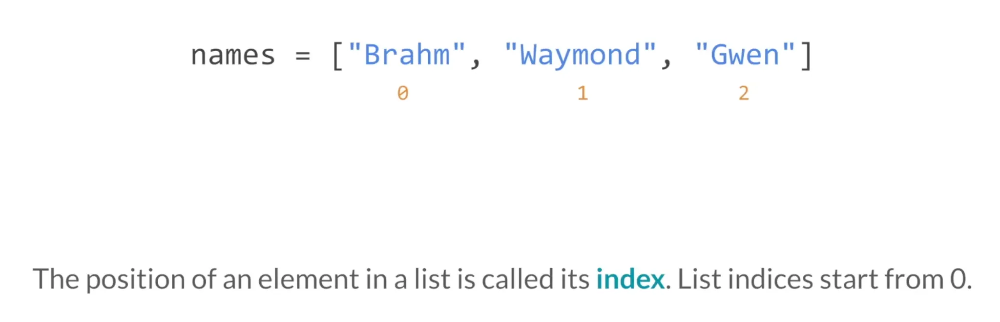
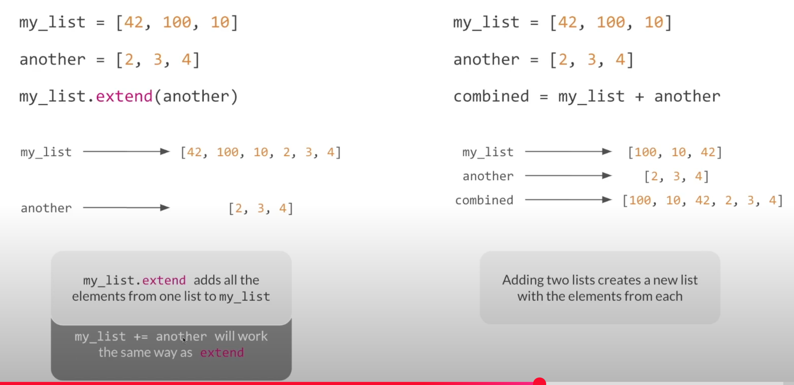
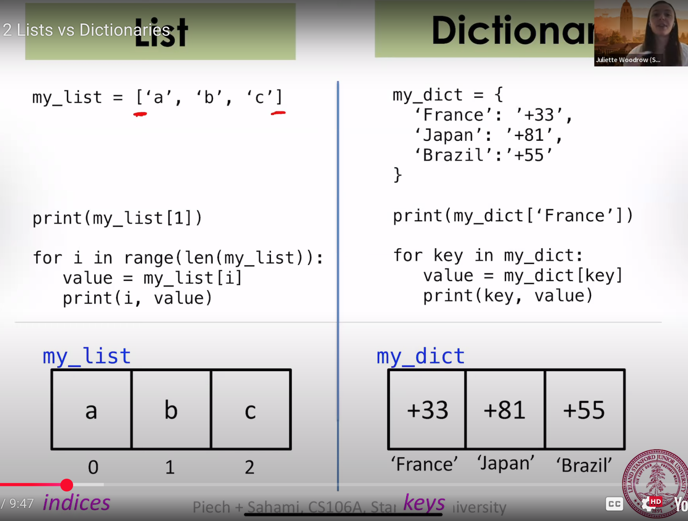

# Week 6 Study Notes: Lists and Dictionaries in Python

## Data Structures
Definition: A data structure allows us to store multiple values in a single variable.

## List
### Creating Lists
```python
# A list of known values:
my_list = [item1, item2, item3]

# A list of repeated values:
my_list = [initial_value] * size

# An empty list:
my_list = []
```

### Accessing Elements by Index

```python
# Get and update individual elements:
name = names[3]       # Access element at index 3
names[1] = 'Rebecca'  # Change value at index 1

# Slicing:
print(name[1:4])       # Elements from index 1 to 3 (not 4)
print(letters[:3])     # Elements from index 0 to 2
print(letters[3:])     # Elements from index 3 to the end
```

### Iterating Over Lists
```python
# Method 1: Using index when position matters
for i in range(len(my_list)):
    print(my_list[i])

# Method 2: Direct access to values
for value in my_list:
    print(value)
```

### List Size
```python
size = len(my_list)
```

### Adding and Removing Elements
```python
my_list.append(value)         # Add to the end
my_list.insert(index, value)  # Insert at a specific index

my_list.remove(value)         # Remove first occurrence
removed = my_list.pop()       # Remove and return last item
```

### Merging Lists

```python
combined = list1 + list2
```

### Searching in Lists
```python
if value in my_list:
    print("Found it!")

index = my_list.index(value)  # Get index of value, only the first one returns

max_value = max(my_list)
min_value = min(my_list)
sum_of_values = sum(my_list)
```

### Checking if List is Empty
```python
if my_list:
    print("List has elements")
else:
    print("List is empty")

while my_list:
    # Loop until the list is empty
    pass
```

## Dictionary
Definition: A dictionary associates a key (unique) with a value.
In Python, dictionary keys must be hashable (immutable types like str, int, etc.).

### Creating Dictionaries
```python
empty_dict = {}
phone = {'Pat': '555-1212', 'Jenny': '867-5309'}  #phone['Pat'] is '555-1212'
squares = {2: 4, 3: 9, 4: 16, 5: 25}
dict[key] = value #create a dictionary through kye-value

# Adding or modifying entries
ages['Chris'] = 32
ages['Chris'] = 30
phone['Pat'] = None         #create a key and its value is empty
ages['Mehran'] += 3

```

### Accessing Keys and Values
```python
value = ages['Chris']
all_keys = ages.keys()       
all_values = ages.values()   
```

### Safe Access and Key Check
```python
if 'Cyrus' in final_grades:
    print("Cyrus's grade: " + final_grades['Cyrus'])

removed_value = dictionary.pop(key, None)  # Remove a key safely
```

### Looping Through a Dictionary
```python
# Loop through keys
for key in ages:
    print(f"{key} -> {ages[key]}")

# Loop through keys explicitly
for key in ages.keys():
    print(f"{key} -> {ages[key]}")

# Loop through values
for value in ages.values():
    print(value)

# Loop through key-value pairs
for key, value in ages.items():
    print(f"{key} -> {value}")
```

### List and Dictionary


### Removing Elements
```python
deleted = ages.pop('Chris')    #delete one key-value，and return value
del ages['Chris']              #delete one key-value，and not return
ages.clear()                   #clear a dictionary       
```

### Dictionary to List Conversion
```python
keys_list = list(ages.keys())
values_list = list(ages.values())
```


This summary covers the core usage of lists and dictionaries from Week 6 in Code in Place. Use this as a reference for your final project or to strengthen your understanding.

— Avelyn W. Z